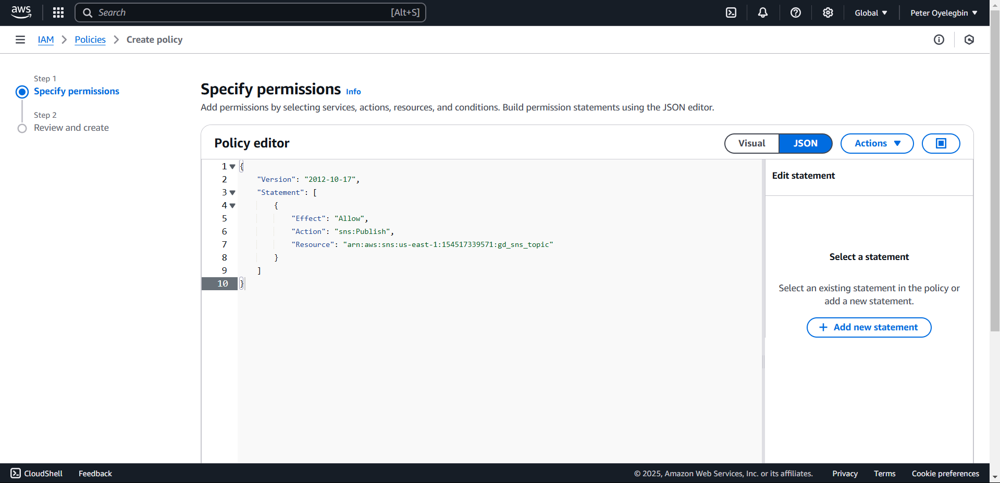
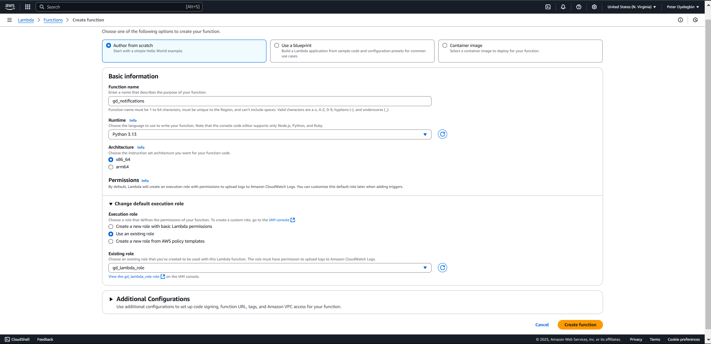

# 30 Days DevOps Challenge - Game Day Notification
**Project Overview:** This project implements event-driven architecture for an alert system that sends real-time NBA game day score notifications to subscribed users via SMS/Email. It utilizes the following AWS services and tools:
- **Amazon Simple Notification Service (SNS):** For sending SMS and email notifications.
- **AWS Lambda:** To process and handle API data and notifications.
- **Amazon EventBridge:** For scheduling automation tasks.
- **NBA APIs:** For fetching live game scores.

The project demonstrates cloud computing principles and efficient notification mechanisms.

---

## Features
1. Fetches live NBA game scores using an external API.
2. Sends formatted score updates to subscribers via SMS/Email using Amazon SNS.
3. Scheduled automation for regular updates using Amazon EventBridge.
4. Designed with security in mind, following the principle of least privilege for IAM roles.

---

## Step-by-Step Procedure
1. **Setup SportsData.io:**
   - Create a free account at [sportsdata.io](https://sportsdata.io).
   - Obtain your NBA API key.

2. **Configure AWS Services:**
   - Create an SNS Topic
     1. Navigate to the **SNS Console** on AWS.
     2. Click on **Create topic** and choose **Standard**.
     3. Provide a name for your topic, e.g., `gd_sns_topic` as shown below.
        
     4. Note the **ARN (Amazon Resource Name)** in the image below and click **Create subscription**.
        
     5. Add subscriber (SMS or Email):
        - For SMS, provide a phone number.
        - For Email, provide an email address and confirm the subscription.
        
             
   - Create an IAM Policies:
     1. Navigate to the **IAM Console** and click on **Policies**, then click **Create policies**.
        
     2. Select **SNS** as a service
        
     3. Switch from **visual** to **JSON**, to modify configurations as shown below
        
        
   - Create an IAM Role for Lambda:
     1. Navigate to the **IAM Console** and click on **Roles**, then click **Create role**.
        
     2. Select **Lambda** as a **service/use case** as shown below:
        
     3. Add the following permissions as shown below:
        - `gd_sns_policy`
        
        - `AWSLambdaBasicExecutionRole`
        
     4. Assign a name to the role, e.g., `gd-lambda-role`.
        

   - Create the Lambda Function:
     1. Open the **Lambda Console** and click **Create Function**.
     2. Choose **Author from scratch** and name the function, e.g., `gd-notifications`.
        
     3. Assign the previously created IAM role to the function (`gd-lambda-Role`).

   - Add the Python Code:
     1. Copy the sample Lambda function from `src/gd-notification.py` to the aws code editor
        
     2. Click the **deploy** button
     4. Navigate to the **configuration** tab and click **Environment Variables**, then click **Edit** to add Environment Variables:
        
     6. Add the two Environment Variables as shown below:
        - `NBA_API_KEY`: Your API key from SportsData.io.
        - `SNS_TOPIC_ARN`: The ARN of your SNS topic.
        
     7. Test the function:
        
        - If you encounter a **timeout error**, go to the **general configuration** and edit the timeout.
          
        - Increase the timeout to **15 seconds**.
          

   - Set up an EventBridge Rule:
     1. Go to the **EventBridge Console** and create a rule.
        
     2. Assing a name to eventbridge `gd_rule` and select **schedule** as shown below:
        
     3. Configure **schedule pattern** and set a **cron expression** (e.g., every 15 minutes)
        
     4. Set the target as the Lambda function you create `gd-notification` as shown below:
        
     5. Click next and keep the other setting as the default
        
     8. 

---

## Testing
Confirm that the EventBridge triggers the Lambda function as scheduled.

---

## Conclusion
This project demonstrates my hands-on approach to delivering an event-driven architecture using AWS services and APIs. By following this guide, you can set up and customize the system to meet your requirements.
